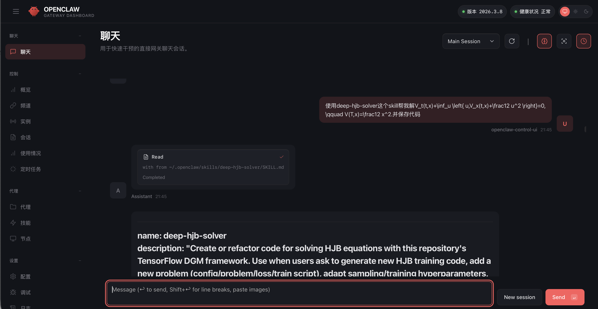
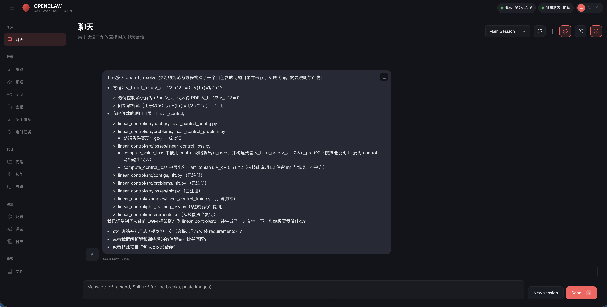
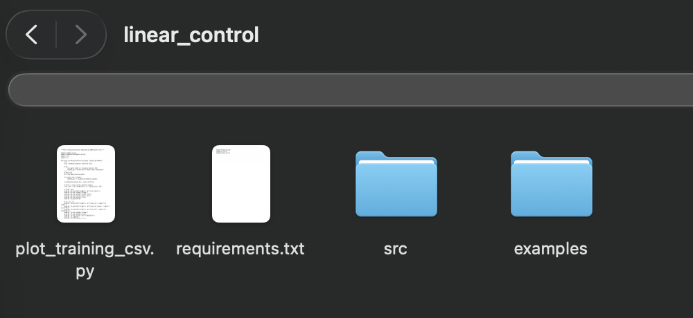

<div align="center">

#  Deep HJB Solver Skill

### 让你的龙虾学会解 HJB 方程

*Teach your OpenClaw to solve Hamilton–Jacobi–Bellman equations with deep learning*

---

[](https://www.python.org/)
[](https://www.tensorflow.org/)
[](https://arxiv.org/abs/2511.04309)
[](LICENSE)
[](https://github.com/)

<br/>


</div>


## Overview

**Deep HJB Solver Skill** 是一个专为 **OpenClaw** 打造的 Skill，把你的龙虾变成一个会**Hamilton–Jacobi–Bellman (HJB) 方程**的天选打工人。它内置了完整的基于**DeepPAAC**框架——神经网络、采样器、训练器——让生成的代码一次跑通。


---

##  Features

| 功能 | 说明 |
|------|------|
|  **自动脚手架** | 秒级生成 config / problem / loss / 训练脚本，全部已连通 |
|  **PDE 残差填充** | 根据问题描述自动填入 HJB 残差和一阶条件 |
|  **超参适配** | 架构、学习率调度、采样范围，随改随用 |
|  **绘图与分析** | 从训练器 CSV 输出自动生成图表 |
|  **二阶导数支持** | 内置 `batch_jacobian` 模式，正确处理 $V_{xx}$ 项 |
|  **多维支持** | 支持任意维度 $d \geq 1$ |

---

## Skill Structure

```
deep-hjb-solver/
├── SKILL.md                          # 触发规则与完整工作流
├── references/
│   ├── repo-conventions.md           # API 签名、命名规范、安全边界
│   └── training-output-contract.md   # CSV schema、绘图要求
└── assets/
    ├── requirements.txt
    ├── plot_training_csv.py
    └── src/                          # 内置 DeepPAAC 框架（自包含）
        ├── configs/
        │   └── common_config.py
        ├── models/
        │   └── dgm_net.py
        ├── problems/
        │   └── base_problem.py
        ├── samplers/
        │   ├── uniform_sampler.py     # 1D 标量边界
        │   └── uniform_sampler_2d.py  # 多维（d ≥ 2）
        ├── trainers/
        │   └── dgm_trainer.py
        └── utils/
            └── visualization.py
```

---

## Quick Start

### 1. 安装 skill

把`deep-hjb-solver-skill`文件夹复制到openclaw的`skills`文件夹下。

or
```bash
clawhub install deep-hjb-solver-skill
```


### 2. Ask OpenClaw

打开 OpenClaw，直接描述你的 HJB 问题：

OpenClaw 会自动完成以下全部步骤:

1. 用 `cp -r` 将 `assets/src/` 复制到 `<slug>/src/`
2. 生成 `<slug>/src/configs/<slug>_config.py`
3. 生成 `<slug>/src/problems/<slug>_problem.py`
4. 生成 `<slug>/src/losses/<slug>_loss.py`
5. 生成 `<slug>/examples/<slug>_train.py`
6. 在各 `__init__.py` 中注册新类
7. 根据你的描述填入 PDE 残差和终端条件

### 3. 配置环境

```bash
cd <slug>
pip install -r requirements.txt
```

### 4. 运行训练

```bash
cd <slug>
python examples/<slug>_train.py
```

结果保存至 `<slug>/results/`。/ Results are saved to `<slug>/results/`.

---

## 操作实例

**Step 1 — 描述问题，OpenClaw 自动生成配置文件:**



**Step 2 — 自动填入 PDE 残差和 Loss 函数:**



**Step 3 — 生成训练脚本**



---


## Requirements

- Python ≥ 3.9
- TensorFlow ≥ 2.12


---

## Citation

If this project helps your research, please cite:

```bibtex
@article{ludkovski2025deeppaacnewdeepgalerkin,
  title={DeepPAAC: A New Deep Galerkin Method for Principal-Agent Problems}, 
  author={Michael Ludkovski and Changgen Xie and Zimu Zhu},
  year={2025},
  eprint={2511.04309},
  archivePrefix={arXiv},
  url={https://arxiv.org/abs/2511.04309}
}
```

---

## Acknowledgments

This implementation builds upon the Deep Galerkin Method framework from:

- A. Al-Aradi, A. Correia, D. Naiff, G. Jardim, and Y. F. Saporito, "Extensions of the deep Galerkin method," *Applied Mathematics and Computation*, vol. 430, p. 127287, 2022. [[arXiv:1912.01455]](https://arxiv.org/abs/1912.01455) · [[GitHub]](https://github.com/alialaradi/DeepGalerkinMethod)

- J. Sirignano and K. Spiliopoulos, "DGM: A deep learning algorithm for solving partial differential equations," *Journal of Computational Physics*, 2018.


